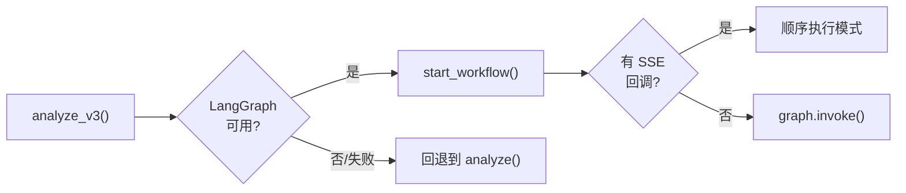
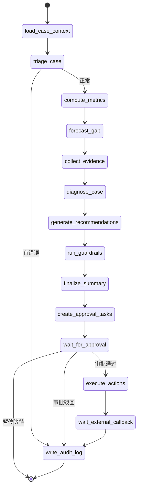
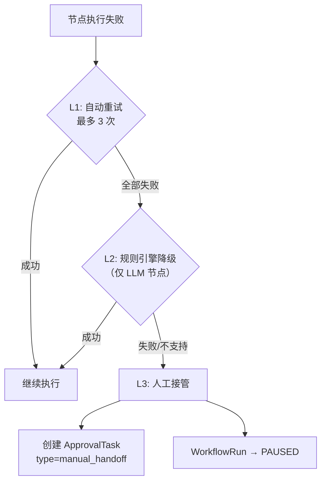
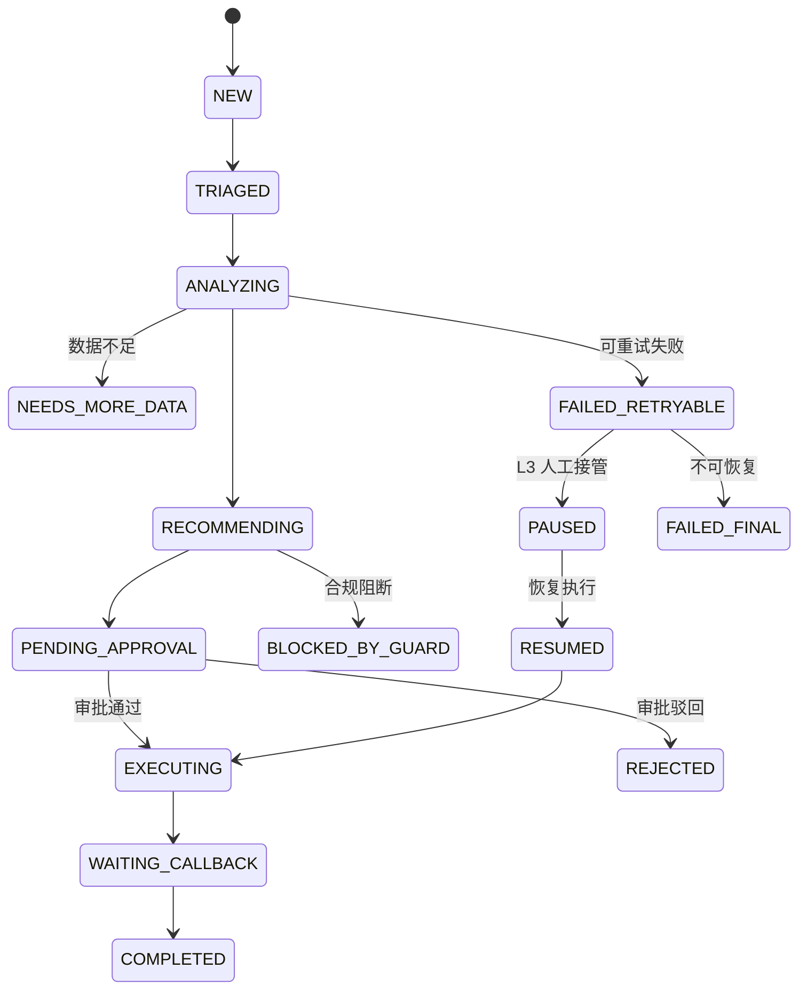
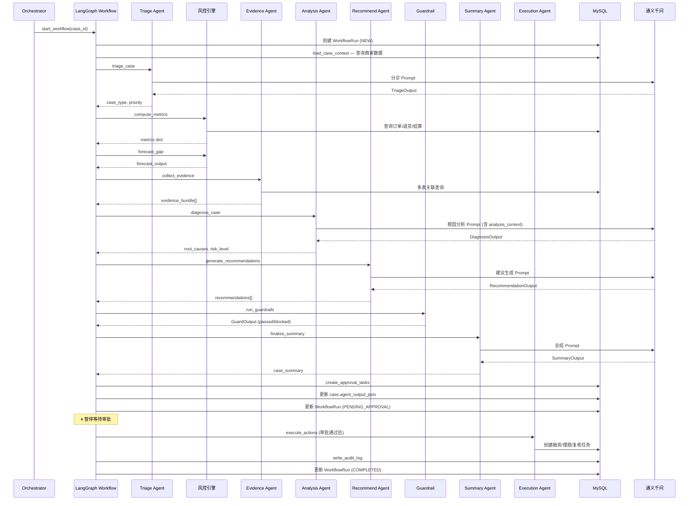
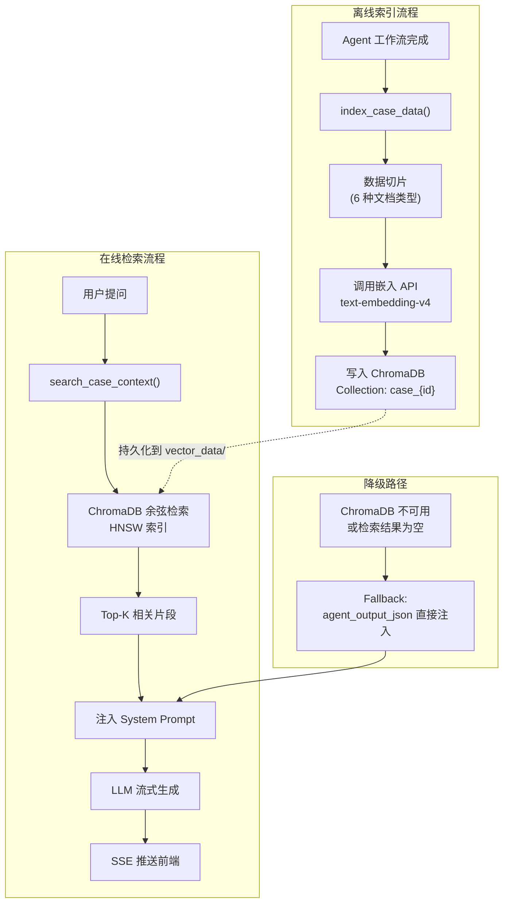
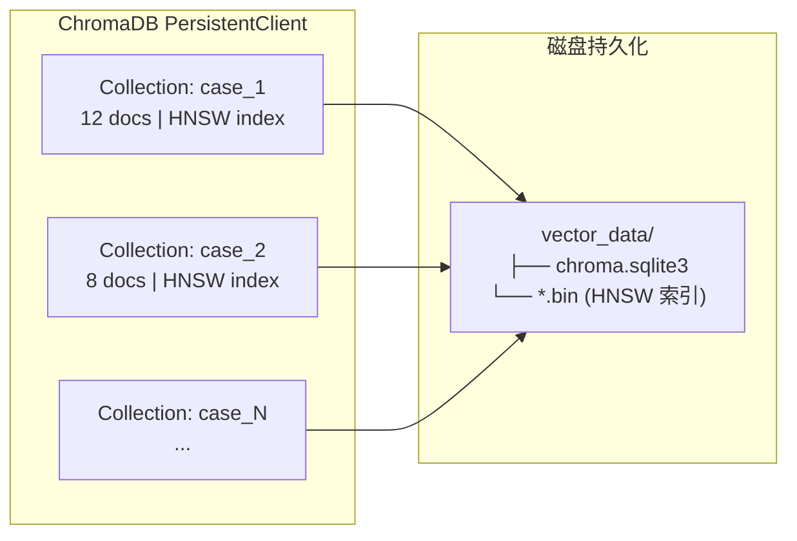
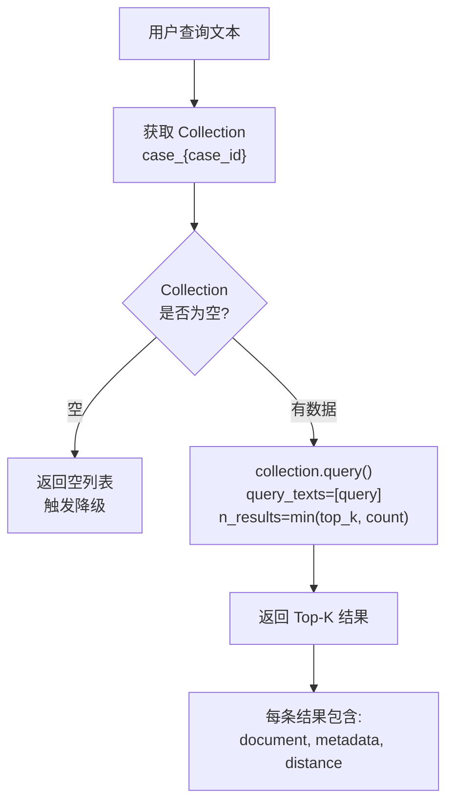
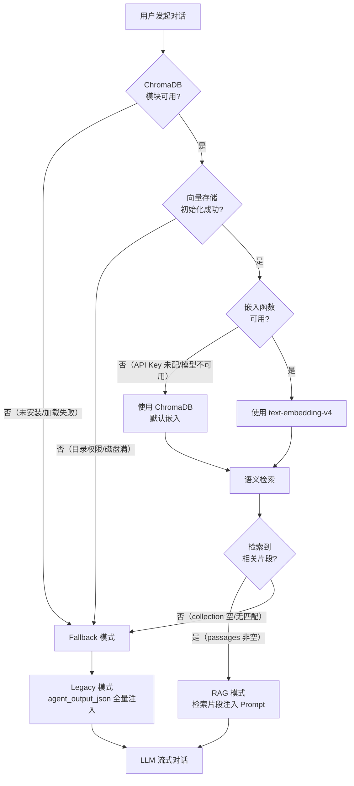

# 多 Agent 智能体系统设计

> 商家经营保障 Agent V3 — 后端技术设计文档（版本基线：V5）
>
> 相关文档：[后端架构概览](./backend-architecture-overview.md) | [API 接口与数据模型](./backend-api-data-design.md) | [基础设施与运维](./backend-infra-operations.md)

---

## 1. Agent 角色卡片

系统包含 7 个业务 Agent + 1 个 Orchestrator 编排器。每个 Agent 独立负责一个分析环节，通过 Orchestrator 串联为完整的风控分析流程。

### 1.1 Triage Agent — 案件分诊

| 属性 | 描述 |
|------|------|
| **文件** | `agents/triage_agent.py` |
| **职责** | 根据商家数据判断案件类型（现金缺口/疑似欺诈/融资/理赔）和优先级（高/中/低），决定后续处理路径 |
| **输入 Schema** | `AgentInput` — 通用输入（case_id, merchant_id, trigger_type 等） |
| **输出 Schema** | `TriageOutput` — case_type（枚举）、priority（枚举）、recommended_path、reasoning |
| **Prompt 设计** | System Prompt 描述分诊规则和案件类型定义；User Prompt 传入商家概况和触发指标 |
| **异常策略** | 失败时默认分类为 `cash_gap` + `medium` 优先级，不阻断后续流程 |

### 1.2 Analysis Agent（Diagnosis Agent）— 根因分析

| 属性 | 描述 |
|------|------|
| **文件** | `agents/analysis_agent.py` |
| **职责** | 对商家经营数据进行多维度根因分析，输出结构化的风险评估报告 |
| **输入 Schema** | 商家指标 `metrics`、证据列表 `evidence` |
| **输出 Schema** | `DiagnosisOutput` — root_causes（含 label/explanation/confidence/evidence_ids）、business_summary、risk_level、manual_review_required |
| **Prompt 设计** | System Prompt 定义分析维度（退货异常、资金缺口、物流异常等）；User Prompt 传入结构化指标数据；使用 `analysis_context` 累积前置 Agent 洞察 |
| **异常策略** | LLM 失败时通过 L2 降级到规则引擎 `rules.evaluate_risk()` 生成基础评估 |

### 1.3 Evidence Agent — 证据收集

| 属性 | 描述 |
|------|------|
| **文件** | `agents/evidence_agent.py` |
| **职责** | 从多个数据源（订单、退货、物流、结算、规则匹配）提取和整理风险证据链 |
| **输入 Schema** | 数据库 Session + RiskCase 对象 |
| **输出 Schema** | `EvidenceOutput` — evidence_bundle（证据列表，含 evidence_id/type/summary/importance_score）、coverage_summary |
| **Prompt 设计** | 纯数据库查询逻辑，不依赖 LLM。通过 SQL 查询关联数据，按规则计算重要性评分 |
| **异常策略** | 部分数据源失败不影响整体，返回已收集到的证据 |

### 1.4 Recommend Agent — 建议生成

| 属性 | 描述 |
|------|------|
| **文件** | `agents/recommend_agent.py` |
| **职责** | 基于分析结果和业务规则，生成具体处置建议（融资/理赔/人工复核） |
| **输入 Schema** | 商家信息、指标、预测缺口、证据 |
| **输出 Schema** | `RecommendationOutput` — risk_level、recommendations（含 action_type/title/why/expected_benefit/confidence/requires_manual_review/evidence_ids） |
| **Prompt 设计** | System Prompt 定义可用的动作类型和融资资格规则；User Prompt 传入指标摘要和证据链 |
| **异常策略** | LLM 失败时通过 L2 降级到 `rules.generate_rule_recommendations()` |

### 1.5 Compliance Agent（Guardrail）— 合规校验

| 属性 | 描述 |
|------|------|
| **文件** | `agents/guardrail.py` + `agents/compliance_agent.py` |
| **职责** | 校验 Agent 输出的合规性：JSON Schema 校验、强制人工复核规则、禁止性结论检查、证据完整性 |
| **输入 Schema** | AgentOutput 格式的完整输出 |
| **输出 Schema** | `GuardOutput` — passed（布尔）、reason_codes、blocked_actions、next_state、details |
| **校验规则** | 1. `business_loan` / `anomaly_review` 类建议强制 `requires_manual_review=true`<br>2. 禁止性关键词列表（"建议直接放款"、"建议拒赔"等）<br>3. 所有建议必须关联 evidence_ids<br>4. 输出必须通过 `AgentOutput` Pydantic 校验 |
| **异常策略** | 校验失败时自动尝试修复（强制设置 requires_manual_review），修复后仍失败则阻断工作流 |

### 1.6 Summary Agent — 报告总结

| 属性 | 描述 |
|------|------|
| **文件** | `agents/summary_agent.py` |
| **职责** | 生成人类可读的案件处理摘要，包含案件概况、根因、建议、执行状态 |
| **输入 Schema** | GraphState 中的 diagnosis_output、recommendation_output、evidence_output 等 |
| **输出 Schema** | `SummaryOutput` — case_summary、action_results、final_status、total_processing_time_ms |
| **Prompt 设计** | System Prompt 要求生成简洁的中文摘要；User Prompt 传入前序所有 Agent 的输出 |
| **异常策略** | 失败时回退为拼接前序输出的模板化摘要 |

### 1.7 Execution Agent — 执行落地

| 属性 | 描述 |
|------|------|
| **文件** | `agents/execution_agent.py` |
| **职责** | 将审批通过的建议转化为具体业务任务（融资申请/理赔申请/人工复核任务） |
| **输入 Schema** | 审批结果、推荐列表 |
| **输出 Schema** | 执行结果列表 |
| **执行逻辑** | 调用 `task_generator.generate_tasks_for_case()` 创建数据库记录，非 LLM 驱动 |
| **异常策略** | 单个任务创建失败不影响其他任务，记录错误后继续 |

---

## 2. Orchestrator 编排机制

`orchestrator.py` 是 Agent 层的统一入口，提供两个版本的分析入口：

### 2.1 V1/V2 串行编排 — `analyze()`


- **7 步串行流水线**，每步均有进度回调和数据库持久化
- 支持 `on_progress` 回调推送进度事件到 SSE
- 异常时**整体回退**到 `_fallback_analysis()` — 仅输出结构化指标 + 规则建议
- 分析前清理旧数据（`_cleanup_case_data()`），确保幂等性

### 2.2 V3 LangGraph 编排 — `analyze_v3()`



- **向后兼容**：返回格式与 V1/V2 完全一致
- **双模式执行**：有 SSE 回调时使用顺序执行（支持进度推送），无回调时使用 LangGraph 原生 `invoke()`
- **多级回退**：V3 失败 → V1/V2 → 规则引擎
- 分析前调用 `db.commit()` 释放 SQLite 写锁（避免独立 session 死锁）

### 2.3 Guardrail 机制

合规守卫在工作流中的触发点和行为：

| 触发位置 | 触发条件 | 拦截行为 |
|----------|----------|----------|
| `run_guardrails` 节点（V3 工作流） | 每次 Agent 输出后自动触发 | 校验失败时尝试自动修复 → 修复失败则设置 `BLOCKED_BY_GUARD` 状态 |
| `guardrail_check` 步骤（V1/V2 串行） | 建议生成后触发 | 校验失败抛 `ValueError`，触发整体回退 |

**守卫规则优先级**：
1. JSON Schema 校验 — 最高优先级，确保数据结构完整
2. 强制人工复核 — `business_loan` / `anomaly_review` 必须设置 `requires_manual_review=true`
3. 禁止性结论检查 — 5 个禁止性关键词
4. 证据完整性 — 每条建议必须关联 `evidence_ids`

---

## 3. LangGraph 工作流引擎

### 3.1 GraphState 状态定义

`workflow/state.py` 定义了工作流节点间共享的状态结构：

```python
class GraphState(TypedDict, total=False):
    # 案件基础信息
    case_id: int                    # 案件 ID
    merchant_id: int                # 商家 ID
    workflow_run_id: int            # 工作流运行记录 ID

    # 各节点输出（按执行顺序填充）
    case_context: dict              # load_case_context 输出
    triage_output: dict             # TriageOutput 序列化
    metrics: dict                   # compute_metrics 输出
    forecast_output: dict           # ForecastOutput 序列化
    diagnosis_output: dict          # DiagnosisOutput 序列化
    evidence_output: dict           # EvidenceOutput 序列化
    recommendation_output: dict     # RecommendationOutput 序列化
    guard_output: dict              # GuardOutput 序列化
    summary_output: dict            # SummaryOutput 序列化

    # 审批与执行
    approval_task_ids: list         # 创建的审批任务 ID
    approval_results: dict          # 审批结果
    execution_results: list         # 执行动作结果

    # 状态控制
    current_status: str             # 当前 WorkflowStatus 枚举值
    error_message: str              # 错误信息（非空时触发异常路由）
    should_pause: bool              # 暂停标志（等待审批时设为 True）
    analysis_context: str           # Agent 间累积式上下文（通过 append_analysis_context 追加）
```

### 3.2 StateGraph 节点与边定义



**14 个节点**（全部定义在 `workflow/nodes.py`）：

| 节点 | 中文名 | 是否调用 LLM | 依赖 Agent |
|------|--------|-------------|-----------|
| `load_case_context` | 加载案件上下文 | ❌ | — |
| `triage_case` | 案件分诊 | ✅ | Triage Agent |
| `compute_metrics` | 计算商家指标 | ❌ | — |
| `forecast_gap` | 现金缺口预测 | ❌ | — |
| `collect_evidence` | 收集证据 | ❌ | Evidence Agent |
| `diagnose_case` | 诊断根因 | ✅ | Analysis Agent |
| `generate_recommendations` | 生成建议 | ✅ | Recommend Agent |
| `run_guardrails` | 合规校验 | ❌ | Guardrail |
| `finalize_summary` | 生成分析总结 | ✅ | Summary Agent |
| `create_approval_tasks` | 创建审批任务 | ❌ | — |
| `wait_for_approval` | 等待审批 | ❌ | — |
| `execute_actions` | 执行动作 | ❌ | Execution Agent |
| `wait_external_callback` | 等待外部回调 | ❌ | — |
| `write_audit_log` | 写入审计日志 | ❌ | — |

**3 个条件路由函数**：
- `route_after_triage()` — triage 后根据 error_message 决定走正常路径还是直接审计
- `route_after_guardrails()` — 合规校验后根据 `passed` / `next_state` 决定进入审批或阻断
- `route_after_approval()` — 审批后根据 `should_pause` / `current_status` 决定执行、拒绝或暂停

### 3.3 三级重试与降级策略

`workflow/retry.py` 实现了三级降级机制：



| 级别 | 策略 | 适用节点 | 实现函数 |
|------|------|----------|----------|
| **L1** | 指数退避重试（1s, 2s, 4s） | 所有节点 | `retry_node()` / `retry_with_backoff()` |
| **L2** | 降级到规则引擎 | `diagnose_case`, `generate_recommendations` | `fallback_to_rules()` |
| **L3** | 创建人工接管任务，工作流暂停 | 所有节点 | `create_manual_handoff()` |

**三级降级调度器**：`execute_with_fallback()` 函数统一管理以上三级策略的串联调用。

### 3.4 WorkflowStatus 状态枚举



---

## 4. Agent Schema 数据契约

`agents/schemas.py` 定义了所有 Agent 的输入/输出 Pydantic 模型，分为三组：

### 4.1 通用输入契约

```python
class AgentInput(BaseModel):
    case_id: str         # 案件编号，如 "RC-2026-0001"
    merchant_id: str     # 商家 ID
    state_version: int   # 状态版本号（用于并发控制）
    trigger_type: str    # 触发类型：scheduled_scan / manual / workflow
    context_refs: list   # 引用的上下文版本列表
    policy_version: str  # 策略版本
```

### 4.2 各 Agent 输出 Schema

| Schema 类 | 所属 Agent | 核心字段 | 下游消费者 |
|-----------|-----------|---------|-----------|
| `TriageOutput` | Triage | case_type, priority, recommended_path | Orchestrator 路由决策 |
| `DiagnosisOutput` | Analysis | root_causes[], business_summary, risk_level | Summary、Recommend |
| `ForecastOutput` | Forecast（规则） | daily_forecasts[], gap_amount, min_cash_point | Recommend |
| `EvidenceOutput` | Evidence | evidence_bundle[], coverage_summary | Recommend、Guardrail |
| `RecommendationOutput` | Recommend | risk_level, recommendations[] | Guardrail、Summary、Execution |
| `GuardOutput` | Compliance | passed, reason_codes, blocked_actions, next_state | Orchestrator 路由决策 |
| `SummaryOutput` | Summary | case_summary, action_results[], final_status | API 返回给前端 |

### 4.3 V1/V2 兼容输出

`AgentOutput` 类保持向后兼容，V1/V2 串行分析和 V3 工作流最终都返回此格式：

```python
class AgentOutput(BaseModel):
    case_id: str
    risk_level: str
    case_summary: str
    root_causes: List[RootCause]
    cash_gap_forecast: CashGapForecast
    recommendations: List[ActionRecommendation]
    manual_review_required: bool
```

### 4.4 Agent 间上下文传递

`analysis_context` 字段实现了 Agent 间的累积式上下文传递：

- 每个 Agent 执行后通过 `append_analysis_context()` 追加洞察
- 单条追加上限 200 字符，总上下文上限 1500 字符
- 超限时 FIFO 淘汰最早的条目
- 格式：`[agent_name] insight_text`，各条之间换行分隔

---

## 5. Agent 间协作时序图



---

## 6. RAG 知识增强检索系统

RAG（Retrieval-Augmented Generation）系统为对话式分析提供语义级上下文注入能力。当用户针对某个案件提问时，系统通过向量检索从案件知识库中召回最相关的文档片段，注入 LLM Prompt，使模型能够基于**已有分析结果**精准回答，而非凭空生成。

### 6.1 整体架构



### 6.2 嵌入模型选型

| 属性 | 配置 |
|------|------|
| **模型** | 阿里云通义 `text-embedding-v4`（通过 DashScope OpenAI 兼容接口调用） |
| **向量维度** | 1024 维 |
| **最大输入长度** | 8192 Token |
| **接口协议** | OpenAI Embeddings API 兼容（`/v1/embeddings`） |
| **调用方式** | `OpenAICompatibleEmbedding` 类，封装 `openai.Client.embeddings.create()` |
| **批量策略** | 初始 batch_size = 6（`EMBEDDING_BATCH_SIZE` 可配置），API 拒绝时自动减半重试，最小降至 1 |
| **降级策略** | API Key 未配置或嵌入函数初始化失败时，回退到 ChromaDB 内置的默认嵌入模型（Sentence Transformers） |

**选型理由**：
- text-embedding-v4 是阿里云通义系列最新嵌入模型，中文语义理解能力强
- 与 Agent 分析使用的通义千问 LLM 同属一套模型家族，语义空间对齐度高
- 通过 OpenAI 兼容接口调用，代码层面可无缝切换其他嵌入模型（如 OpenAI text-embedding-3-small）

### 6.3 文档切片设计

每个案件的数据通过 `index_case_data(case_id)` 函数切片为以下 **6 种文档类型**，每种切片策略不同：

| 文档类型 | 数据来源 | 切片粒度 | metadata 标签 | 典型切片数 |
|----------|----------|----------|---------------|-----------|
| **案件摘要** | `agent_output.case_summary` | 整段（1 片） | `source=summary_agent, type=case_summary` | 1 |
| **根因分析** | `agent_output.root_causes[]` | 每个根因独立成片 | `source=diagnosis_agent, type=root_cause, evidence_ids=EV-101,EV-102` | 2~5 |
| **动作建议** | `agent_output.recommendations[]` | 每条建议独立成片 | `source=recommendation_agent, type=recommendation, action_type=business_loan, evidence_ids=EV-103` | 2~4 |
| **现金流预测** | `agent_output.cash_gap_forecast` | 整段（1 片） | `source=forecast_agent, type=forecast` | 0~1 |
| **证据项** | `evidence_items` 表 | 每条证据独立成片 | `source=evidence_agent, type=evidence, evidence_id=EV-101, evidence_type=order` | 3~10 |
| **商家信息** | `merchants` 表 | 整段（1 片） | `source=merchant_profile, type=merchant` | 1 |

**切片文本格式示例**：

```text
# 根因分析切片
"根因: 退货率激增 — 近7日退货率从5.2%飙升至18.7%，超出行业均值3倍 (置信度: 92%)"

# 动作建议切片
"建议[business_loan]: 申请经营贷30万元 — 商家近期现金流吃紧，退货率异常导致应收账款积压"

# 证据项切片
"[order] 近7日订单金额波动异常，标准差达到历史均值的2.3倍"

# 商家信息切片
"商家信息: XX数码旗舰店, 行业: 数码, 店铺等级: 5, 结算周期: 14天"
```

**设计决策**：
- **按语义单元切片**（而非固定长度）：每条根因、建议、证据都是独立的语义单元，保证检索时召回的是完整的上下文
- **典型案件切片数**：10~20 片，单片平均 50~150 字符
- **幂等索引**：每次索引前先清除该案件的旧数据（`collection.delete()`），确保重新分析后数据不重复
- **ID 命名**：`case_{case_id}_{type}_{counter}`，全局唯一

### 6.4 向量存储设计

| 属性 | 配置 |
|------|------|
| **存储引擎** | ChromaDB 0.5.x（嵌入式向量数据库） |
| **客户端类型** | `PersistentClient`（数据持久化到本地磁盘） |
| **持久化目录** | `backend/vector_data/`（通过 `VECTOR_STORE_DIR` 可配置） |
| **索引算法** | HNSW（Hierarchical Navigable Small World） |
| **距离度量** | Cosine Similarity（`hnsw:space=cosine`） |
| **Collection 隔离** | 每个案件独立一个 Collection，名称为 `case_{case_id}` |
| **客户端管理** | 全局懒加载单例（`_get_client()`），首次访问时初始化 |



**Collection 隔离的设计理由**：
- 案件之间的数据完全无关，隔离 Collection 避免跨案件干扰
- 单个 Collection 文档数少（10~20），HNSW 索引效率极高
- 支持独立删除/重建某案件的索引，不影响其他案件

### 6.5 召回策略

#### 检索接口

`search_case_context(case_id, query, top_k=5)` 负责在线语义检索：



#### 召回参数

| 参数 | 默认值 | 说明 |
|------|--------|------|
| `top_k` | 5（`RAG_TOP_K` 配置） | 返回最相关的 K 条文档 |
| `n_results` | `min(top_k, collection.count())` | 防止请求数大于实际文档数 |
| 距离度量 | cosine | 值越小越相关（0=完全相同，2=完全不相关） |

#### 召回结果注入 Prompt

检索到的片段按相关性排序后注入 System Prompt：

```text
你是一个专业的风控分析助手。以下是当前案件的分析上下文，请基于这些已有数据和分析结果回答用户的问题。
如果问题超出已有数据范围，请如实回答'暂无相关数据'。不要编造不存在的数据。

## 语义检索结果（与用户问题最相关的案件信息）
1. 根因: 退货率激增 — 近7日退货率从5.2%飙升至18.7% (置信度: 92%) [来源: diagnosis_agent]
2. 建议[business_loan]: 申请经营贷30万元 — 商家现金流吃紧 [来源: recommendation_agent]
3. [order] 近7日订单金额波动异常 [来源: evidence_agent, EV-103]
4. 现金流预测: 预计14日内缺口¥50,000 [来源: forecast_agent]
5. 商家信息: XX旗舰店, 行业: 数码, 店铺等级: 5 [来源: merchant_profile]

## 商家信息
名称: XX数码旗舰店
行业: 数码
...
```

**Prompt 组装规则**：
- 检索结果按 ChromaDB 返回的相关性排序（distance 升序）
- 每条结果附带 `[来源: {source}]` 标签，支持追溯
- 若证据项有 `evidence_id`，标签格式为 `[来源: {source}, {evidence_id}]`
- 检索结果之后补充商家基础信息（RAG 可能不完全覆盖）

#### 对话历史管理

| 参数 | 值 | 说明 |
|------|-----|------|
| 滑动窗口 | 最近 20 轮（40 条消息） | 超出时截断最早的对话 |
| LLM 温度 | 0.3 | 偏向确定性回答，减少幻觉 |
| 最大生成 Token | 2048 | 控制单轮回复长度 |

### 6.6 多级降级策略

RAG 系统在每个环节都设计了降级路径，确保对话功能在任何异常下可用：



| 降级层级 | 触发条件 | 降级行为 | 数据质量 |
|----------|----------|----------|----------|
| **L0 正常** | 一切正常 | text-embedding-v4 语义检索 → Top-K 注入 | ⭐⭐⭐ 精准召回 |
| **L1 嵌入降级** | OPENAI_API_KEY 未配置 / 嵌入 API 失败 | ChromaDB 默认 Sentence Transformers 嵌入 | ⭐⭐ 基本可用 |
| **L2 检索降级** | ChromaDB 不可用 / Collection 为空 / 检索无结果 | `agent_output_json` 全量注入 System Prompt | ⭐ 全量上下文，无精准召回 |
| **L3 LLM 降级** | LLM 未启用 | 返回固定提示 "当前 LLM 未启用" | ❌ 无法对话 |

### 6.7 索引触发时机

| 触发点 | 触发方式 | 说明 |
|--------|----------|------|
| V1/V2 分析完成 | `orchestrator.analyze()` 末尾调用 `index_case_data()` | 分析结果保存后自动索引 |
| V3 工作流完成 | `workflow/nodes.py` 的 `finalize_summary` 节点后 | 工作流写入 `agent_output_json` 后触发 |
| 手动触发 | 暂无 | 可通过管理 API 扩展 |

### 6.8 配置参数汇总

| 配置项 | 环境变量 | 默认值 | 说明 |
|--------|----------|--------|------|
| 向量存储目录 | `VECTOR_STORE_DIR` | `backend/vector_data/` | ChromaDB 持久化路径 |
| 嵌入模型 | `EMBEDDING_MODEL` | `text-embedding-v4` | 通义嵌入模型名称 |
| 嵌入批量大小 | `EMBEDDING_BATCH_SIZE` | `6` | 单次嵌入 API 请求的文本数 |
| 检索 Top-K | `RAG_TOP_K` | `5` | 语义检索返回的最相关文档数 |
| 对话滑动窗口 | 代码硬编码 | `20` 轮（40 条） | 对话历史最大保留轮数 |
| LLM 温度 | 代码硬编码 | `0.3` | 对话生成温度 |
| LLM 最大 Token | 代码硬编码 | `2048` | 单轮回复最大 Token 数 |

---

## 7. 演进建议

| 方向 | 建议 | 优先级 |
|------|------|--------|
| **Agent 工具调用** | 引入 LangGraph ToolNode，让 Agent 自主决定调用哪些工具（而非预定义流程） | 高 |
| **并行节点** | 将 `compute_metrics` + `forecast_gap` + `collect_evidence` 改为并行执行 | 中 |
| **Prompt 模板化** | 统一使用 Jinja2 模板引擎管理 Prompt，支持条件渲染和变量注入 | 中 |
| **Schema 版本协商** | 实现 Agent 间的 Schema 版本协商，支持渐进式 Schema 升级 | 低 |
| **RAG 混合检索** | 引入 BM25 关键词检索 + 向量语义检索的混合召回策略，提升长尾查询的召回率 | 中 |
| **RAG 重排序** | 在 Top-K 召回后引入 Cross-Encoder Reranker 精排，提升上下文注入质量 | 中 |
| **文档分块优化** | 对长文本字段（如 case_summary）引入滑动窗口分块 + 重叠策略，提升细粒度召回 | 低 |
| **多案件跨检索** | 支持跨案件的全局语义检索，用于相似案件推荐和历史经验引用 | 低 |
