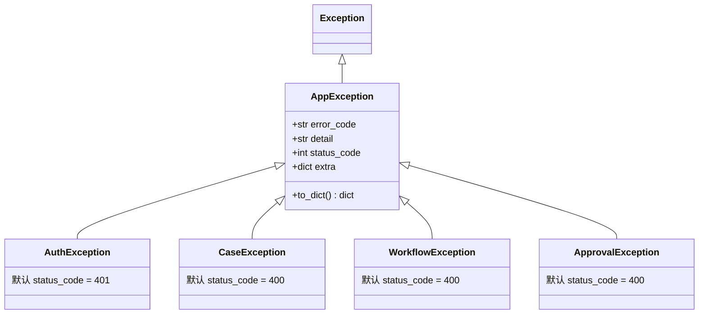
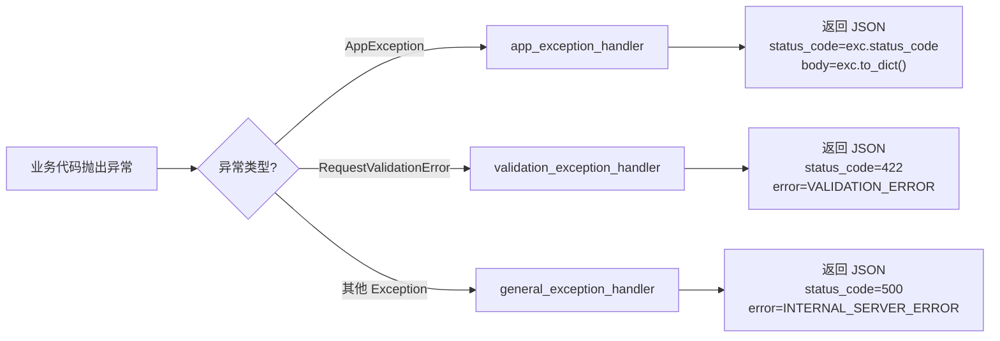
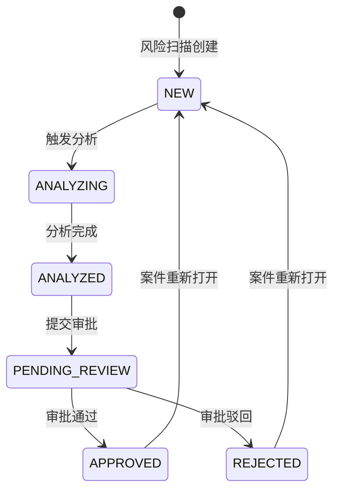
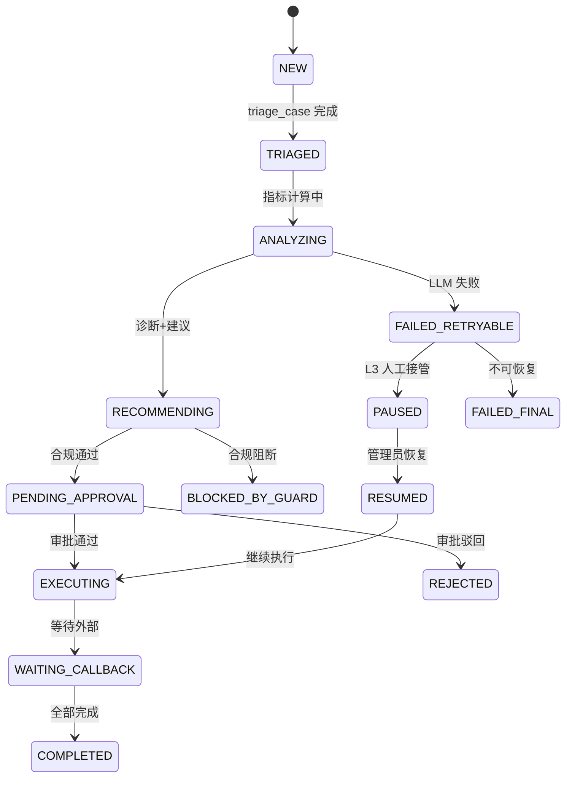
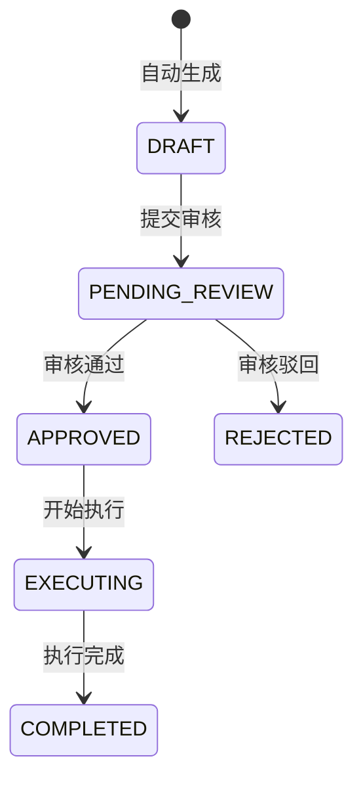
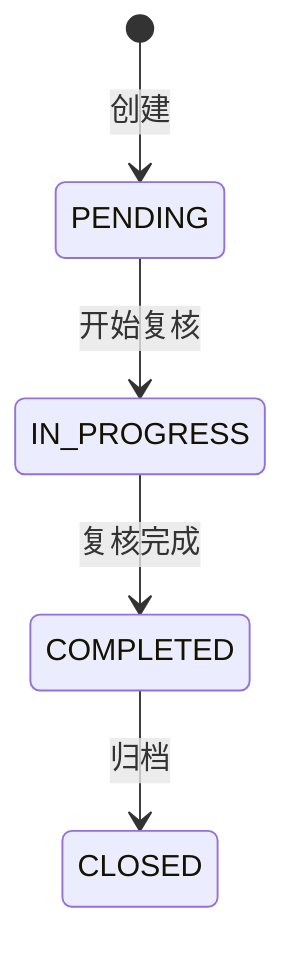
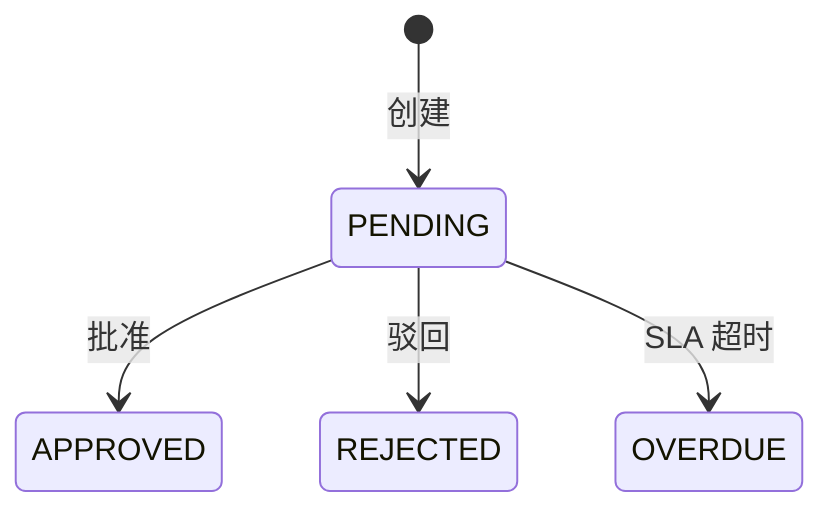

# API 接口与数据模型设计

> 商家经营保障 Agent V3 — 后端技术设计文档（版本基线：V5）
>
> 相关文档：[后端架构概览](./backend-architecture-overview.md) | [多 Agent 智能体系统设计](./backend-agent-system-design.md) | [基础设施与运维](./backend-infra-operations.md) | [数据模型 ER 图](./data-model.md)

---

## 1. API 模块概览

所有 API 统一挂载在 FastAPI 应用下，通过 `app.include_router()` 注册。API 前缀规则：V1/V2 路由使用 `/api` 前缀，V3+ 路由在 Router 内部定义前缀（如 `/api/approvals`、`/api/evals`）。

### 1.1 风险案件 API — `api/risk_cases.py`

**路由前缀**：`/api`（通过 `app.include_router(risk_cases.router, prefix="/api")` 挂载）

| 方法 | 路径 | 用途 |
|------|------|------|
| GET | `/api/risk-cases` | 案件列表（支持 risk_level/status/merchant_name 筛选、分页、排序） |
| GET | `/api/risk-cases/{case_id}` | 案件详情（含商家信息、指标、趋势、证据、建议、审批、审计日志） |
| POST | `/api/risk-cases/{case_id}/analyze` | 触发重新分析（支持 `mode=v1` / `mode=v3`） |
| POST | `/api/risk-cases/{case_id}/analyze/stream` | SSE 流式分析（实时推送进度和 LLM 输出） |
| GET | `/api/risk-cases/{case_id}/analysis-progress` | 获取分析进度（刷新页面恢复工作流面板） |
| GET | `/api/risk-cases/{case_id}/evidence` | 获取证据列表 |
| POST | `/api/risk-cases/{case_id}/review` | 审批案件（通过/驳回） |
| GET | `/api/risk-cases/{case_id}/export` | 导出案件（Markdown/JSON 格式） |
| POST | `/api/risk-cases/{case_id}/generate-financing-application` | 手动触发融资申请生成 |
| POST | `/api/risk-cases/{case_id}/generate-claim-application` | 手动触发理赔申请生成 |
| POST | `/api/risk-cases/{case_id}/generate-manual-review` | 手动触发复核任务生成 |
| GET | `/api/risk-cases/{case_id}/tasks` | 查询案件关联的所有执行任务 |

### 1.2 仪表盘 API — `api/dashboard.py`

**路由前缀**：`/api`

| 方法 | 路径 | 用途 |
|------|------|------|
| GET | `/api/dashboard/stats` | 看板顶部指标卡（商家数、高风险案件数、总预测缺口、平均结算延迟） |

### 1.3 任务管理 API — `api/tasks.py`

**路由前缀**：`/api`

| 方法 | 路径 | 用途 |
|------|------|------|
| GET | `/api/tasks` | 统一任务列表（融资/理赔/复核，支持 task_type/status 筛选、分页） |
| GET | `/api/tasks/{task_type}/{task_id}` | 任务详情（根据 task_type 查询不同表） |
| PUT | `/api/tasks/{task_type}/{task_id}/status` | 任务状态流转（遵循状态机规则） |

### 1.4 工作流管理 API — `api/workflows.py`

**路由前缀**：`/api`

| 方法 | 路径 | 用途 |
|------|------|------|
| POST | `/api/workflows/start` | 启动新工作流 |
| POST | `/api/workflows/{run_id}/resume` | 恢复暂停的工作流（带审批结果） |
| POST | `/api/workflows/{run_id}/retry` | 重试失败的工作流 |
| GET | `/api/workflows/{run_id}` | 工作流运行详情 |
| GET | `/api/workflows/{run_id}/trace` | 工作流执行轨迹（Agent 运行记录列表） |
| GET | `/api/workflows` | 工作流运行列表（支持 status/case_id 筛选、分页） |
| GET | `/api/cases/{case_id}/latest-run` | 获取案件最新的工作流运行 |
| POST | `/api/cases/{case_id}/reopen` | 重新打开已完成的案件 |

### 1.5 审批中心 API — `api/approvals.py`

**路由前缀**：`/api/approvals`

| 方法 | 路径 | 用途 |
|------|------|------|
| GET | `/api/approvals` | 审批任务列表（支持 status/approval_type 筛选、分页） |
| GET | `/api/approvals/{approval_id}` | 审批任务详情 |
| POST | `/api/approvals/{approval_id}/approve` | 批准审批任务 |
| POST | `/api/approvals/{approval_id}/reject` | 驳回审批任务 |
| POST | `/api/approvals/{approval_id}/revise-and-approve` | 修改后批准（附带修改内容） |
| POST | `/api/approvals/batch` | 批量审批 |

### 1.6 配置管理 API — `api/configs.py`

**路由前缀**：`/api`

| 方法 | 路径 | 用途 |
|------|------|------|
| GET | `/api/agent-configs` | 获取所有 Agent 的 Prompt/Schema 配置 |
| POST | `/api/prompt-versions` | 创建新的 Prompt 版本 |
| POST | `/api/prompt-versions/{version_id}/activate` | 激活 Prompt 版本 |
| POST | `/api/prompt-versions/{version_id}/rollback` | 回滚 Prompt 版本 |
| GET | `/api/prompt-versions` | Prompt 版本列表 |
| POST | `/api/schema-versions` | 创建新的 Schema 版本 |
| POST | `/api/model-policies` | 模型策略管理 |

### 1.7 评测中心 API — `api/evals.py`

**路由前缀**：`/api/evals`

| 方法 | 路径 | 用途 |
|------|------|------|
| POST | `/api/evals/datasets` | 创建评测数据集 |
| GET | `/api/evals/datasets` | 评测数据集列表 |
| GET | `/api/evals/datasets/{dataset_id}` | 数据集详情 |
| PUT | `/api/evals/datasets/{dataset_id}` | 更新数据集 |
| POST | `/api/evals/datasets/import-from-cases` | 从历史案件导入评测数据 |
| POST | `/api/evals/runs` | 启动评测运行 |
| GET | `/api/evals/runs/{eval_run_id}` | 评测运行详情（含结果列表） |
| GET | `/api/evals/runs` | 评测运行列表 |
| GET | `/api/evals/sampling` | 采样查看评测样本 |

### 1.8 对话式分析 API — `api/conversations.py`

**路由前缀**：`/api`

| 方法 | 路径 | 用途 |
|------|------|------|
| POST | `/api/cases/{case_id}/conversations` | 创建新对话 |
| GET | `/api/cases/{case_id}/conversations` | 获取案件的对话列表 |
| GET | `/api/conversations/{conversation_id}/messages` | 获取对话消息历史 |
| POST | `/api/conversations/{conversation_id}/chat/stream` | SSE 流式对话（RAG 增强） |

### 1.9 可观测性 API — `api/observability.py`

**路由前缀**：`/api/observability`

| 方法 | 路径 | 用途 |
|------|------|------|
| GET | `/api/observability/summary` | 概览指标（分析量、响应时间、成功率、降级次数） |
| GET | `/api/observability/latency-trend` | 延迟趋势图数据 |
| GET | `/api/observability/agent-latency` | 各 Agent 延迟统计 |
| GET | `/api/observability/workflow-status` | 工作流状态分布 |

### 1.10 认证 API — `api/auth.py`

**路由前缀**：`/api/auth`

| 方法 | 路径 | 用途 |
|------|------|------|
| POST | `/api/auth/setup` | 系统初始化（创建首个管理员账号） |
| POST | `/api/auth/register` | 管理员注册新用户 |
| POST | `/api/auth/public-register` | 公开注册（自助注册） |
| POST | `/api/auth/login` | 用户登录（返回 Access + Refresh Token） |
| POST | `/api/auth/refresh` | Token 刷新 |
| POST | `/api/auth/change-password` | 修改密码 |
| GET | `/api/auth/me` | 获取当前登录用户信息 |
| GET | `/api/auth/check-init` | 检查系统是否已初始化 |

### 1.11 用户管理 API — `api/users.py`

**路由前缀**：`/api/users`

| 方法 | 路径 | 用途 |
|------|------|------|
| GET | `/api/users` | 用户列表 |
| PUT | `/api/users/{user_id}/status` | 启用/禁用用户 |
| PUT | `/api/users/{user_id}/role` | 修改用户角色 |
| POST | `/api/users/{user_id}/reset-password` | 重置密码 |
| DELETE | `/api/users/{user_id}` | 删除用户 |

---

## 2. API 设计规范

### 2.1 命名约定

| 规则 | 说明 | 示例 |
|------|------|------|
| **路径命名** | kebab-case（小写 + 连字符） | `/api/risk-cases`, `/api/agent-configs` |
| **资源复数** | 资源名使用复数形式 | `/api/workflows`, `/api/approvals` |
| **嵌套资源** | 表达所属关系 | `/api/cases/{case_id}/conversations` |
| **动作端点** | POST + 动词 | `/api/workflows/{id}/resume`, `/api/approvals/{id}/approve` |

### 2.2 分页格式

```json
{
  "items": [...],
  "total": 120,
  "page": 1,
  "page_size": 20
}
```

查询参数：`page` (默认 1, ≥1) + `page_size` (默认 20, 1~100)

对应 Pydantic Schema：`PaginatedResponse`

### 2.3 通用响应结构

**成功响应**（直接返回业务数据）：
```json
{
  "status": "success",
  "data": { ... }
}
```

**错误响应**（统一格式）：
```json
{
  "error": "CASE_NOT_FOUND",
  "detail": "案件不存在",
  "status_code": 404
}
```

### 2.4 SSE 流式端点

流式端点使用 `text/event-stream` 媒体类型，事件格式：

```
event: progress
data: {"step": "diagnose_case", "step_name": "诊断根因", "status": "running", ...}

event: llm_chunk
data: {"content": "根据分析...", "agent_name": "analysis_agent", ...}

event: complete
data: {"agent_output": {...}}

event: error
data: {"error": "分析超时"}
```

---

## 3. 错误码体系

### 3.1 错误码常量（`core/error_codes.py`）

按模块分类，命名格式：`{MODULE}_{ERROR_TYPE}`（大写蛇形命名法）

| 模块 | 错误码 | 含义 |
|------|--------|------|
| **认证** | `AUTH_INVALID_CREDENTIALS` | 用户名或密码错误 |
| | `AUTH_TOKEN_EXPIRED` | Token 已过期 |
| | `AUTH_TOKEN_INVALID` | Token 无效 |
| | `AUTH_INSUFFICIENT_PERMISSIONS` | 权限不足 |
| | `AUTH_USER_NOT_FOUND` | 用户不存在 |
| | `AUTH_USER_DISABLED` | 用户已禁用 |
| **案件** | `CASE_NOT_FOUND` | 案件不存在 |
| | `CASE_ALREADY_EXISTS` | 案件已存在 |
| | `CASE_INVALID_STATUS` | 案件状态无效 |
| | `CASE_OPERATION_NOT_ALLOWED` | 操作不允许 |
| | `CASE_DATA_VALIDATION_ERROR` | 数据校验失败 |
| | `CASE_ANALYSIS_FAILED` | 分析失败 |
| **工作流** | `WORKFLOW_NOT_FOUND` | 工作流不存在 |
| | `WORKFLOW_INVALID_STATE` | 状态无效 |
| | `WORKFLOW_TRANSITION_ERROR` | 状态流转错误 |
| | `WORKFLOW_NODE_EXECUTION_FAILED` | 节点执行失败 |
| | `WORKFLOW_TIMEOUT` | 超时 |
| | `WORKFLOW_CONFIG_ERROR` | 配置错误 |
| **审批** | `APPROVAL_NOT_FOUND` | 审批任务不存在 |
| | `APPROVAL_ALREADY_PROCESSED` | 已处理 |
| | `APPROVAL_INVALID_DECISION` | 无效决定 |
| | `APPROVAL_PERMISSION_DENIED` | 权限拒绝 |
| | `APPROVAL_WORKFLOW_ERROR` | 工作流错误 |
| **通用** | `VALIDATION_ERROR` | 请求数据验证失败 |
| | `INTERNAL_SERVER_ERROR` | 服务器内部错误 |
| | `SERVICE_UNAVAILABLE` | 服务不可用 |
| | `DATABASE_ERROR` | 数据库错误 |
| | `EXTERNAL_API_ERROR` | 外部 API 错误 |

### 3.2 异常类层次结构（`core/exceptions.py`）



### 3.3 全局异常处理链路



---

## 4. 数据模型设计补充

> 完整的表结构定义请参考 [数据模型 ER 图](./data-model.md)

### 4.1 核心枚举状态流转图

#### CaseStatus — 案件状态



#### WorkflowStatus — 工作流运行状态



#### TaskStatus — 融资/理赔任务状态



#### ReviewTaskStatus — 人工复核任务状态



#### ApprovalStatus — 审批任务状态



### 4.2 数据模型演进时间线

| 版本 | 新增表 | 关键变更 |
|------|--------|----------|
| **V1** | merchants, orders, returns, logistics_events, settlements, insurance_policies, financing_products, risk_cases, evidence_items, recommendations, reviews, audit_logs | 核心业务表建立 |
| **V2** | financing_applications, claims, manual_reviews | 任务执行子系统（融资/理赔/复核） |
| **V3** | workflow_runs, agent_runs, checkpoints, approval_tasks, tool_invocations, prompt_versions, schema_versions, eval_datasets, eval_runs, eval_results, users | 多 Agent 生产化、审批工作流、评测中心、用户认证 |
| **V4** | conversations, conversation_messages | 对话式分析、RAG 向量检索 |
| **V5** | — | MySQL 迁移、eval_results 新增 LLM-Judge 字段（judge_score, judge_reasoning 等）、eval_runs 新增进度字段 |

### 4.3 索引策略

| 表 | 索引 | 用途 |
|------|------|------|
| risk_cases | `ix_risk_cases_merchant_id` | 按商家查询案件 |
| risk_cases | `ix_risk_cases_status` | 按状态筛选 |
| risk_cases | `ix_risk_cases_risk_level` | 按风险等级筛选 |
| workflow_runs | `ix_workflow_runs_case_id`, `ix_workflow_runs_status` | 案件关联查询、状态筛选 |
| agent_runs | `ix_agent_runs_workflow_run_id`, `ix_agent_runs_agent_name` | 工作流关联、Agent 统计 |
| approval_tasks | `ix_approval_tasks_case_id`, `ix_approval_tasks_status`, `ix_approval_tasks_workflow_run_id` | 审批列表多维筛选 |
| financing_applications | `ix_financing_applications_case_id`, `ix_financing_applications_status` | 案件关联、状态筛选 |
| claims | `ix_claims_case_id`, `ix_claims_status` | 案件关联、状态筛选 |
| manual_reviews | `ix_manual_reviews_case_id`, `ix_manual_reviews_status` | 案件关联、状态筛选 |
| conversations | `ix_conversations_case_id` | 案件对话查询 |
| conversation_messages | `ix_conversation_messages_conversation_id` | 对话消息查询 |

---

## 5. Pydantic Schema 层设计

### 5.1 文件组织

| 文件 | 覆盖范围 |
|------|----------|
| `schemas/schemas.py` | 通用 Schema：案件列表/详情、仪表盘、任务、趋势数据等 |
| `schemas/auth_schemas.py` | 认证 Schema：登录/注册请求、Token 响应、用户信息 |
| `schemas/approval_schemas.py` | 审批 Schema：审批任务响应、批准/驳回/修改后批准请求 |

### 5.2 命名规范

| 类型 | 命名规则 | 示例 |
|------|----------|------|
| 请求模型 | `{Action}{Resource}Request` | `ReviewRequest`, `LoginRequest`, `ApproveRequest` |
| 响应模型 | `{Resource}Response` | `TokenResponse`, `UserResponse`, `CaseDetailResponse` |
| 列表项模型 | `{Resource}ListItem` | `RiskCaseListItem`, `UnifiedTaskListItem` |
| 创建模型 | `{Resource}Create` | `FinancingApplicationCreate`, `ClaimCreate` |
| 更新模型 | `{Resource}Update` / `{Resource}StatusUpdate` | `TaskStatusUpdate` |

### 5.3 与 ORM Model 的映射

- Schema 与 ORM Model 通过 `class Config: from_attributes = True` 启用自动转换
- 响应 Schema 使用 `model_validate(orm_instance)` 进行 ORM → Pydantic 转换
- 日期时间字段统一转为 `Optional[str]` 字符串格式返回前端
- JSON 存储字段（`*_json`）在 Schema 层解析为 `Optional[Any]` 类型

### 5.4 通用分页响应

```python
class PaginatedResponse(BaseModel):
    items: List[Any]   # 列表项（泛型设计）
    total: int         # 总记录数
    page: int          # 当前页码
    page_size: int     # 每页条数
```

---

## 6. 演进建议

| 方向 | 建议 | 优先级 |
|------|------|--------|
| **API 版本化** | 引入 `/api/v1/` 前缀，当前所有端点归入 v1，为后续不兼容变更预留空间 | 中 |
| **分页 Schema 泛型化** | 使用 `PaginatedResponse[T]` 泛型，提供强类型的分页响应 | 低 |
| **数据库迁移** | 引入 Alembic 管理数据库 Schema 迁移，取代 `create_all()` 方式 | 高 |
| **错误码编号化** | 为每个错误码分配唯一数字编号（如 `10001`），便于日志检索和客户端处理 | 低 |
