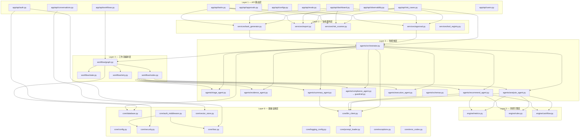
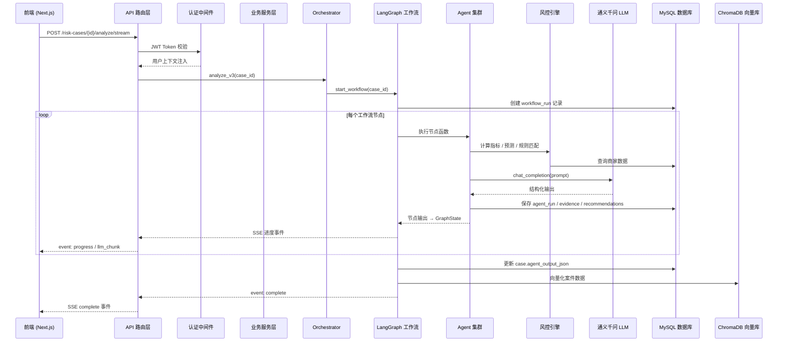

# 后端架构概览

> 商家经营保障 Agent V3 — 后端技术设计文档（版本基线：V5）
>
> 相关文档：[多 Agent 智能体系统设计](./backend-agent-system-design.md) | [API 接口与数据模型](./backend-api-data-design.md) | [基础设施与运维](./backend-infra-operations.md) | [数据模型 ER 图](./data-model.md)

---

## 1. 六层架构概览

后端采用分层架构设计，共 6 层，遵循**上层只调用下层、禁止跨层或反向调用**的约束：



### 各层职责

| 层级 | 代码目录 | 职责 | 对外接口 |
|------|----------|------|----------|
| **Layer 1 — API 路由层** | `app/api/` | FastAPI Router 定义、请求参数校验（Pydantic）、响应序列化、SSE 流式推送 | HTTP RESTful 端点 |
| **Layer 2 — 业务服务层** | `app/services/` | 审批服务、导出服务、风险扫描、任务生成、工具注册等业务逻辑编排 | Python 函数调用 |
| **Layer 3 — 智能体层** | `app/agents/` | 各 Agent 的 Prompt 构建、LLM 调用封装、结构化输出解析、合规校验 | AgentInput → AgentOutput |
| **Layer 4 — 工作流编排层** | `app/workflow/` | LangGraph StateGraph 定义、节点执行调度、条件路由、重试与降级策略 | start_workflow() / resume_workflow() |
| **Layer 5 — 风控引擎层** | `app/engine/` | 商家指标计算、规则引擎匹配、现金流预测 | Python 函数（纯计算，不依赖 LLM） |
| **Layer 6 — 基础设施层** | `app/core/` | 数据库连接、配置管理、日志框架、JWT 安全、RBAC 权限、LLM 客户端、向量存储、异常体系 | 全局单例 / 依赖注入 |

---

## 2. 技术栈清单

| 类别 | 技术 | 版本约束 | 用途 | 选型理由 |
|------|------|----------|------|----------|
| **Web 框架** | FastAPI | `==0.115.0` | 异步 Web 框架，API 路由与请求处理 | 内置 OpenAPI 自动文档、原生异步支持、Pydantic 集成 |
| **ASGI 服务器** | Uvicorn | `==0.30.0` | ASGI 服务器 | FastAPI 官方推荐的高性能服务器 |
| **ORM** | SQLAlchemy | `==2.0.35` | 数据库 ORM、声明式模型定义 | Python 最成熟的 ORM，支持声明式映射和类型安全查询 |
| **数据校验** | Pydantic | `==2.9.0` | 请求/响应模型、数据校验 | FastAPI 原生集成，V2 性能大幅提升 |
| **配置管理** | pydantic-settings | `==2.5.0` | 环境变量和 `.env` 文件读取 | 类型安全的配置加载，支持分层配置 |
| **LLM 接入** | OpenAI SDK | `>=1.40.0,<2.0.0` | 调用通义千问（DashScope 兼容接口） | 统一的 Chat Completion / Structured Output / Embedding 接口 |
| **工作流引擎** | LangGraph | `>=0.2.0,<1.0.0` | 有状态的多 Agent 编排 | 支持 StateGraph、条件路由、断点恢复 |
| **向量数据库** | ChromaDB | `>=0.5.0,<1.0.0` | RAG 语义检索、案件数据向量化 | 轻量级嵌入式向量数据库，支持持久化和自定义嵌入函数 |
| **关系数据库** | MySQL 8.0 | 生产环境 | 业务数据持久化 | 成熟稳定，社区生态完善 |
| **关系数据库** | SQLite | 开发环境 | 本地开发零配置 | 内嵌式数据库，无需额外安装 |
| **数据库驱动** | PyMySQL | `>=1.1.0,<2.0.0` | MySQL 连接驱动 | 纯 Python 实现，无系统依赖 |
| **JWT 认证** | python-jose | `>=3.3.0,<4.0.0` | JWT Token 生成与校验 | 支持 HS256/RS256，加密扩展完善 |
| **密码哈希** | passlib + bcrypt | `passlib>=1.7.4` / `bcrypt==4.0.1` | 密码安全存储 | bcrypt 是业界标准的密码哈希算法 |
| **日志框架** | Loguru | `>=0.7.0,<1.0.0` | 结构化日志、文件轮转 | 开箱即用，API 简洁，支持自定义 sink |
| **日期工具** | python-dateutil | `==2.9.0` | 日期时间处理 | 标准时间解析工具 |
| **测试框架** | pytest | `>=8.0.0` | 单元测试 / 集成测试 | Python 测试生态标准 |
| **测试异步** | pytest-asyncio | `>=0.23.0` | 异步测试支持 | FastAPI 异步端点测试必需 |
| **HTTP 测试客户端** | httpx | `>=0.27.0` | TestClient 底层 | FastAPI TestClient 的依赖 |

---

## 3. 后端代码目录树

```
backend/
├── app/
│   ├── __init__.py
│   ├── main.py                          # FastAPI 应用入口：中间件注册、路由挂载、全局异常处理
│   │
│   ├── api/                             # Layer 1 — API 路由层
│   │   ├── __init__.py
│   │   ├── risk_cases.py                # 风险案件 CRUD、分析触发、SSE 流式分析、导出
│   │   ├── dashboard.py                 # 首页仪表盘统计数据聚合
│   │   ├── tasks.py                     # 融资/理赔/人工复核 统一任务管理
│   │   ├── workflows.py                 # 工作流运行列表、详情、手动触发/恢复
│   │   ├── approvals.py                 # 审批任务列表、审批操作（通过/驳回）
│   │   ├── configs.py                   # Agent Prompt/Schema 配置管理
│   │   ├── evals.py                     # 评测数据集管理、评测运行、结果查看
│   │   ├── conversations.py             # 对话式分析：消息收发、SSE 流式推送、RAG 检索
│   │   ├── observability.py             # 系统可观测性：Agent 运行统计、工作流指标
│   │   ├── auth.py                      # 认证：登录、注册、Token 刷新、初始化检查
│   │   └── users.py                     # 用户管理：列表、角色变更、密码重置
│   │
│   ├── services/                        # Layer 2 — 业务服务层
│   │   ├── __init__.py
│   │   ├── approval.py                  # 审批服务：案件审批、状态流转、审计日志
│   │   ├── export.py                    # 导出服务：Markdown/JSON 格式导出
│   │   ├── risk_scanner.py              # 风险扫描：批量商家风险评估
│   │   ├── task_generator.py            # 任务生成：根据推荐自动创建融资/理赔/复核任务
│   │   └── tool_registry.py             # 工具注册：Agent 可调用的外部工具注册表
│   │
│   ├── agents/                          # Layer 3 — 智能体层
│   │   ├── __init__.py
│   │   ├── orchestrator.py              # 编排器：V1/V2 串行分析 + V3 LangGraph 调度入口
│   │   ├── triage_agent.py              # 分诊 Agent：案件分类、优先级判断
│   │   ├── analysis_agent.py            # 分析 Agent：根因分析、风险摘要生成
│   │   ├── evidence_agent.py            # 证据 Agent：多源证据收集与整理
│   │   ├── recommend_agent.py           # 建议 Agent：处置建议生成
│   │   ├── compliance_agent.py          # 合规 Agent：合规规则校验
│   │   ├── guardrail.py                 # 守卫规则引擎：禁止性结论检查、强制人工复核
│   │   ├── summary_agent.py             # 总结 Agent：案件最终摘要生成
│   │   ├── execution_agent.py           # 执行 Agent：将建议转化为业务任务
│   │   └── schemas.py                   # Agent 数据契约：所有 Agent 的 Pydantic I/O Schema
│   │
│   ├── workflow/                        # Layer 4 — 工作流编排层
│   │   ├── __init__.py
│   │   ├── graph.py                     # LangGraph StateGraph 构建、节点编排、顺序执行器
│   │   ├── state.py                     # GraphState TypedDict、WorkflowStatus 枚举
│   │   ├── nodes.py                     # 各节点函数实现（与 Agent 层的映射）
│   │   └── retry.py                     # 三级降级策略：L1 自动重试、L2 规则降级、L3 人工接管
│   │
│   ├── engine/                          # Layer 5 — 风控引擎层
│   │   ├── __init__.py
│   │   ├── metrics.py                   # 指标计算：退货率、结算延迟、异常分数等
│   │   ├── rules.py                     # 规则引擎：风险等级评估、融资资格判断
│   │   └── cashflow.py                  # 现金流预测：14 日缺口预测
│   │
│   ├── models/                          # ORM 模型层
│   │   ├── __init__.py
│   │   └── models.py                    # 27 张表的 SQLAlchemy 声明式模型 + 枚举定义
│   │
│   ├── schemas/                         # Pydantic 校验层
│   │   ├── __init__.py
│   │   ├── schemas.py                   # 通用请求/响应 Schema（案件、仪表盘、任务等）
│   │   ├── auth_schemas.py              # 认证相关 Schema（登录、注册、Token）
│   │   └── approval_schemas.py          # 审批相关 Schema
│   │
│   └── core/                            # Layer 6 — 基础设施层
│       ├── __init__.py
│       ├── config.py                    # Settings 类：pydantic-settings 配置（读取 .env）
│       ├── database.py                  # SQLAlchemy 引擎、SessionLocal、get_db 依赖注入
│       ├── security.py                  # JWT Token 生成/校验、密码哈希
│       ├── rbac.py                      # RBAC 角色权限：5 种角色 × 18 种权限
│       ├── auth_middleware.py           # 认证中间件：JWT + DEBUG Header 双模式
│       ├── llm_client.py               # OpenAI SDK 封装：chat_completion / structured_output / stream
│       ├── vector_store.py             # ChromaDB 封装：案件向量化、语义检索、降级处理
│       ├── logging_config.py           # Loguru 日志：控制台 + 文件 sink、按总大小清理
│       ├── prompt_loader.py            # Prompt 版本加载：DB 优先 + 灰度分流 + 内存缓存
│       ├── exceptions.py               # 异常基类 AppException 及子类
│       ├── error_codes.py              # 按模块分类的错误码常量
│       └── utils.py                    # 通用工具函数
│
├── requirements.txt                     # Python 依赖清单
├── Dockerfile                           # 后端 Docker 镜像构建
├── .env.example                         # 环境变量示例
└── logs/                                # 日志输出目录（gitignore）
```

---

## 4. 模块边界与调用约束

### 4.1 层间调用规则

| 规则 | 说明 |
|------|------|
| **单向依赖** | 只允许上层调用下层。例如 API 层可调用 Service 层，但 Service 层不可反向调用 API 层 |
| **跨层调用** | 允许跳层调用（如 API 层可直接调用 Agent 层的 `orchestrator.analyze()`），但需克制使用 |
| **基础设施层** | 所有层均可调用基础设施层（`core/`），它是全局共享的底座 |
| **模型层** | `models/` 和 `schemas/` 是数据定义层，所有层均可导入使用 |

### 4.2 各层对外暴露的接口

**API 路由层 → 外部（前端 / HTTP 客户端）**
- HTTP RESTful 端点（由 FastAPI Router 注册）
- SSE 流式端点（`text/event-stream`）
- 所有端点通过 `AuthMiddleware` 统一鉴权

**业务服务层 → API 层**
- `approval.review_case()` — 审批操作
- `export.export_case_markdown()` / `export_case_json()` — 导出
- `task_generator.generate_tasks_for_case()` — 任务生成
- `risk_scanner.scan_merchants()` — 批量风险扫描

**智能体层 → 服务层 / API 层**
- `orchestrator.analyze()` — V1/V2 串行分析入口
- `orchestrator.analyze_v3()` — V3 LangGraph 工作流入口
- 各 Agent 不直接被外部调用，由 Orchestrator 统一调度

**工作流编排层 → 智能体层 / API 层**
- `graph.start_workflow()` — 启动新工作流
- `graph.resume_workflow()` — 恢复暂停的工作流
- `graph.get_graph()` — 获取编译后的 LangGraph 图实例

**风控引擎层 → 智能体层**
- `metrics.get_all_metrics()` — 获取商家全部指标
- `cashflow.forecast_cash_gap()` — 现金流预测
- `rules.evaluate_risk()` / `rules.generate_rule_recommendations()` — 规则引擎

**基础设施层 → 所有层**
- `config.settings` — 全局配置单例
- `database.get_db()` — 数据库会话依赖注入
- `llm_client.chat_completion()` / `structured_output()` — LLM 调用
- `vector_store.search_case_context()` — 语义检索
- `security.create_access_token()` / `decode_token()` — JWT 操作
- `rbac.has_permission()` — 权限检查

### 4.3 数据流向总览



---

## 5. 演进建议

| 方向 | 建议 | 优先级 |
|------|------|--------|
| **异步化** | 将 SQLAlchemy 迁移到 async session（`create_async_engine`），充分利用 FastAPI 的异步能力 | 中 |
| **缓存层** | 引入 Redis 作为指标缓存和 Session 存储，减少 DB 查询压力 | 中 |
| **消息队列** | 引入 Celery/RQ 异步任务队列，将长时间运行的 Agent 分析从 Web 进程解耦 | 高 |
| **API 版本化** | 引入 `/api/v1/` 前缀，为后续 API 演进预留空间 | 低 |
| **依赖注入** | 统一使用 FastAPI Depends 管理 Service 层依赖，而非直接函数导入 | 低 |
