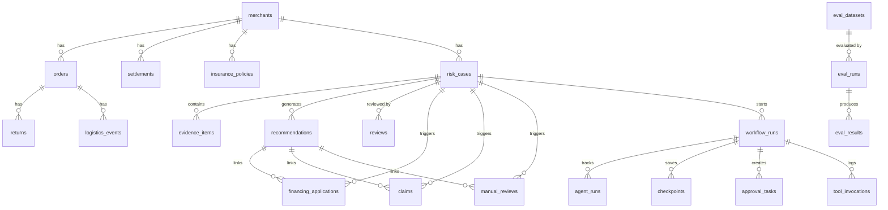

# 📊 数据模型 / Data Model

> 商家经营保障 Agent V3 — 完整数据库表结构与 ER 关系

## ER 关系图 / Entity Relationship Diagram



---

## V1/V2 核心业务表

### 1. merchants — 商家基础信息

| 字段 | 类型 | 说明 |
|------|------|------|
| `id` | Integer PK | 主键 |
| `name` | String(128) | 商家名称 |
| `industry` | String(64) | 行业类目 |
| `settlement_cycle_days` | Integer | 结算周期（天） |
| `store_level` | String(16) | 店铺等级 (gold/silver/bronze) |
| `created_at` | DateTime | 创建时间 |

### 2. orders — 订单

| 字段 | 类型 | 说明 |
|------|------|------|
| `id` | Integer PK | 主键 |
| `merchant_id` | Integer FK → merchants | 商家 ID |
| `sku_id` | String(64) | SKU 编号 |
| `order_amount` | Float | 订单金额 |
| `order_time` | DateTime | 下单时间 |
| `delivered_time` | DateTime | 签收时间 |

### 3. returns — 退货退款

| 字段 | 类型 | 说明 |
|------|------|------|
| `id` | Integer PK | 主键 |
| `order_id` | Integer FK → orders | 订单 ID |
| `return_reason` | String(128) | 退货原因 |
| `return_time` | DateTime | 退货时间 |
| `refund_amount` | Float | 退款金额 |
| `status` | String(32) | 状态 (pending/completed/rejected) |

### 4. logistics_events — 物流事件

| 字段 | 类型 | 说明 |
|------|------|------|
| `id` | Integer PK | 主键 |
| `order_id` | Integer FK → orders | 订单 ID |
| `event_type` | String(32) | 事件类型 (picked_up/in_transit/delivered/returned) |
| `event_time` | DateTime | 事件时间 |

### 5. settlements — 结算回款

| 字段 | 类型 | 说明 |
|------|------|------|
| `id` | Integer PK | 主键 |
| `merchant_id` | Integer FK → merchants | 商家 ID |
| `expected_settlement_date` | Date | 预期结算日 |
| `actual_settlement_date` | Date | 实际结算日 |
| `amount` | Float | 结算金额 |
| `status` | String(32) | 状态 (pending/settled/delayed) |

### 6. insurance_policies — 保险保单

| 字段 | 类型 | 说明 |
|------|------|------|
| `id` | Integer PK | 主键 |
| `merchant_id` | Integer FK → merchants | 商家 ID |
| `policy_type` | String(64) | 保单类型 (shipping_return/freight) |
| `coverage_limit` | Float | 保额上限 |
| `premium_rate` | Float | 费率 |
| `status` | String(32) | 状态 (active/expired) |

### 7. financing_products — 融资产品

| 字段 | 类型 | 说明 |
|------|------|------|
| `id` | Integer PK | 主键 |
| `name` | String(128) | 产品名称 |
| `max_amount` | Float | 最大额度 |
| `eligibility_rule_json` | Text | 资格规则 (JSON) |
| `status` | String(32) | 状态 (active/inactive) |

### 8. risk_cases — 风险案件 ⭐

> 系统核心表，关联 Agent 输出、证据、建议、审批、任务、工作流。

| 字段 | 类型 | 说明 |
|------|------|------|
| `id` | Integer PK | 主键 |
| `merchant_id` | Integer FK → merchants | 商家 ID |
| `risk_score` | Float | 风险评分 |
| `risk_level` | String(16) | 风险等级 (high/medium/low) |
| `trigger_json` | Text | 触发条件 (JSON) |
| `status` | String(32) | 案件状态 (NEW/ANALYZED/PENDING_REVIEW/APPROVED/REJECTED) |
| `agent_output_json` | Text | Agent 分析输出 (JSON) |
| `created_at` | DateTime | 创建时间 |
| `updated_at` | DateTime | 更新时间 |

**索引**: `merchant_id`, `status`, `risk_level`

### 9. evidence_items — 证据项

| 字段 | 类型 | 说明 |
|------|------|------|
| `id` | Integer PK | 主键 |
| `case_id` | Integer FK → risk_cases | 案件 ID |
| `evidence_type` | String(64) | 证据类型 (order/return/logistics/settlement/rule_hit/product_match) |
| `source_table` | String(64) | 来源表 |
| `source_id` | Integer | 来源记录 ID |
| `summary` | Text | 证据摘要 |
| `importance_score` | Float | 重要性评分 |

### 10. recommendations — 建议

| 字段 | 类型 | 说明 |
|------|------|------|
| `id` | Integer PK | 主键 |
| `case_id` | Integer FK → risk_cases | 案件 ID |
| `action_type` | String(64) | 动作类型 |
| `content_json` | Text | 建议内容 (JSON) |
| `confidence` | Float | 置信度 |
| `requires_manual_review` | Integer | 是否需人工复核 (0/1) |
| `task_generated` | Integer | 任务是否已生成 (0/1) |
| `task_type` | String(64) | 任务类型 (financing/claim/manual_review) |
| `task_id` | Integer | 关联任务 ID |

### 11. reviews — 案件审批记录

| 字段 | 类型 | 说明 |
|------|------|------|
| `id` | Integer PK | 主键 |
| `case_id` | Integer FK → risk_cases | 案件 ID |
| `reviewer_id` | String(64) | 审批人 |
| `decision` | String(32) | 决定 (approve/approve_with_changes/reject) |
| `comment` | Text | 审批意见 |
| `final_action_json` | Text | 最终动作 (JSON) |
| `created_at` | DateTime | 审批时间 |

### 12. audit_logs — 审计日志

| 字段 | 类型 | 说明 |
|------|------|------|
| `id` | Integer PK | 主键 |
| `entity_type` | String(64) | 实体类型 |
| `entity_id` | Integer | 实体 ID |
| `actor` | String(64) | 操作人 |
| `action` | String(64) | 操作动作 |
| `old_value` | Text | 旧值 |
| `new_value` | Text | 新值 |
| `created_at` | DateTime | 操作时间 |

### 13. financing_applications — 融资申请

| 字段 | 类型 | 说明 |
|------|------|------|
| `id` | Integer PK | 主键 |
| `merchant_id` | Integer FK → merchants | 商家 ID |
| `case_id` | Integer FK → risk_cases | 案件 ID |
| `recommendation_id` | Integer FK → recommendations | 建议 ID |
| `amount_requested` | Float | 申请金额 |
| `loan_purpose` | String(256) | 贷款用途 |
| `repayment_plan_json` | Text | 还款计划 (JSON) |
| `merchant_info_snapshot_json` | Text | 商家快照 (JSON) |
| `historical_settlement_json` | Text | 历史结算 (JSON) |
| `approval_status` | String(32) | 状态 (DRAFT → PENDING_REVIEW → APPROVED/REJECTED → EXECUTING → COMPLETED) |
| `reviewer_comment` | Text | 审批意见 |
| `created_at` | DateTime | 创建时间 |
| `updated_at` | DateTime | 更新时间 |

**索引**: `case_id`, `approval_status`

### 14. claims — 理赔申请

| 字段 | 类型 | 说明 |
|------|------|------|
| `id` | Integer PK | 主键 |
| `merchant_id` | Integer FK → merchants | 商家 ID |
| `case_id` | Integer FK → risk_cases | 案件 ID |
| `recommendation_id` | Integer FK → recommendations | 建议 ID |
| `policy_id` | Integer FK → insurance_policies | 保单 ID |
| `claim_amount` | Float | 理赔金额 |
| `claim_reason` | String(256) | 理赔原因 |
| `evidence_snapshot_json` | Text | 证据快照 (JSON) |
| `return_details_json` | Text | 退货详情 (JSON) |
| `claim_status` | String(32) | 状态 (DRAFT → PENDING_REVIEW → APPROVED/REJECTED → EXECUTING → COMPLETED) |
| `reviewer_comment` | Text | 审批意见 |
| `created_at` | DateTime | 创建时间 |
| `updated_at` | DateTime | 更新时间 |

**索引**: `case_id`, `claim_status`

### 15. manual_reviews — 人工复核任务

| 字段 | 类型 | 说明 |
|------|------|------|
| `id` | Integer PK | 主键 |
| `merchant_id` | Integer FK → merchants | 商家 ID |
| `case_id` | Integer FK → risk_cases | 案件 ID |
| `recommendation_id` | Integer FK → recommendations | 建议 ID |
| `task_type` | String(64) | 任务类型 (return_fraud/high_risk_mandatory/anomaly_review) |
| `review_reason` | Text | 复核原因 |
| `evidence_ids_json` | Text | 关联证据 (JSON 数组) |
| `assigned_to` | String(64) | 分配给 |
| `status` | String(32) | 状态 (PENDING → IN_PROGRESS → COMPLETED → CLOSED) |
| `review_result` | String(64) | 复核结果 |
| `reviewer_comment` | Text | 复核意见 |
| `created_at` | DateTime | 创建时间 |
| `updated_at` | DateTime | 更新时间 |
| `completed_at` | DateTime | 完成时间 |

**索引**: `case_id`, `status`

---

## V3 多 Agent 生产化表

### 16. workflow_runs — 工作流运行实例 ⭐

> 每次案件分析产生一条 workflow_run，记录完整的执行生命周期。

| 字段 | 类型 | 说明 |
|------|------|------|
| `id` | Integer PK | 主键 |
| `case_id` | Integer FK → risk_cases | 案件 ID |
| `graph_version` | String(64) | 图版本 (e.g. "v3.0") |
| `status` | String(32) | 运行状态（见下方状态枚举） |
| `current_node` | String(128) | 当前执行节点 |
| `started_at` | DateTime | 开始时间 |
| `updated_at` | DateTime | 更新时间 |
| `paused_at` | DateTime | 暂停时间 |
| `resumed_at` | DateTime | 恢复时间 |
| `ended_at` | DateTime | 结束时间 |

**状态枚举**: `NEW` | `TRIAGED` | `ANALYZING` | `RECOMMENDING` | `PENDING_APPROVAL` | `EXECUTING` | `WAITING_CALLBACK` | `COMPLETED` | `NEEDS_MORE_DATA` | `BLOCKED_BY_GUARD` | `REJECTED` | `FAILED_RETRYABLE` | `FAILED_FINAL` | `PAUSED` | `RESUMED`

**索引**: `case_id`, `status`

### 17. agent_runs — Agent 运行记录

> 每个 Agent 节点执行一次就写一条记录，含版本追踪信息。

| 字段 | 类型 | 说明 |
|------|------|------|
| `id` | Integer PK | 主键 |
| `workflow_run_id` | Integer FK → workflow_runs | 工作流运行 ID |
| `agent_name` | String(64) | Agent 名称 |
| `model_name` | String(64) | 模型名称 (e.g. "gpt-4o") |
| `prompt_version` | String(16) | Prompt 版本号 |
| `schema_version` | String(16) | Schema 版本号 |
| `input_json` | Text | 输入 (JSON) |
| `output_json` | Text | 输出 (JSON) |
| `status` | String(32) | 状态 (RUNNING/SUCCESS/FAILED/SKIPPED) |
| `latency_ms` | Integer | 耗时 (毫秒) |
| `created_at` | DateTime | 创建时间 |

**索引**: `workflow_run_id`, `agent_name`

### 18. checkpoints — 工作流断点

| 字段 | 类型 | 说明 |
|------|------|------|
| `id` | Integer PK | 主键 |
| `workflow_run_id` | Integer FK → workflow_runs | 工作流运行 ID |
| `node_name` | String(128) | 节点名称 |
| `checkpoint_blob` | Text | 序列化的 checkpoint 数据 (JSON) |
| `created_at` | DateTime | 创建时间 |

### 19. approval_tasks — 审批任务队列 ⭐

> 由 Compliance Guard 或三级降级 L3 自动创建。

| 字段 | 类型 | 说明 |
|------|------|------|
| `id` | Integer PK | 主键 |
| `workflow_run_id` | Integer FK → workflow_runs | 工作流运行 ID |
| `case_id` | Integer FK → risk_cases | 案件 ID |
| `approval_type` | String(64) | 审批类型 (business_loan/advance_settlement/fraud_review/claim_submission/manual_handoff) |
| `assignee_role` | String(64) | 分配角色 |
| `status` | String(32) | 状态 (PENDING/APPROVED/REJECTED/OVERDUE) |
| `payload_json` | Text | 审批内容 (JSON) |
| `reviewer` | String(64) | 审批人 |
| `reviewed_at` | DateTime | 审批时间 |
| `comment` | Text | 审批意见 |
| `final_action_json` | Text | 最终动作 (JSON) |
| `created_at` | DateTime | 创建时间 |
| `due_at` | DateTime | SLA 截止时间 |

**索引**: `case_id`, `status`, `workflow_run_id`

### 20. tool_invocations — 工具调用日志

| 字段 | 类型 | 说明 |
|------|------|------|
| `id` | Integer PK | 主键 |
| `workflow_run_id` | Integer FK → workflow_runs | 工作流运行 ID |
| `tool_name` | String(128) | 工具名称 |
| `tool_version` | String(32) | 工具版本 |
| `input_json` | Text | 输入 (JSON) |
| `output_json` | Text | 输出 (JSON) |
| `approval_required` | Integer | 是否需审批 (0/1) |
| `approval_status` | String(32) | 审批状态 |
| `status` | String(32) | 执行状态 (PENDING/SUCCESS/FAILED) |
| `idempotency_key` | String(256) UNIQUE | 幂等键 |
| `created_at` | DateTime | 创建时间 |

**索引**: `workflow_run_id`, `tool_name`

### 21. prompt_versions — Prompt 版本管理

| 字段 | 类型 | 说明 |
|------|------|------|
| `id` | Integer PK | 主键 |
| `agent_name` | String(64) | Agent 名称 |
| `version` | String(16) | 版本号 |
| `content` | Text | Prompt 内容 |
| `status` | String(32) | 状态 (DRAFT/ACTIVE/ARCHIVED) |
| `canary_weight` | Float | 灰度权重 (0.0~1.0) |
| `created_at` | DateTime | 创建时间 |

**索引**: `agent_name`

> 💡 灰度机制：当 `canary_weight > 0` 的 DRAFT 版本存在时，按概率分配流量到灰度版本。

### 22. schema_versions — Schema 版本管理

| 字段 | 类型 | 说明 |
|------|------|------|
| `id` | Integer PK | 主键 |
| `agent_name` | String(64) | Agent 名称 |
| `version` | String(16) | 版本号 |
| `json_schema` | Text | JSON Schema 内容 |
| `created_at` | DateTime | 创建时间 |

**索引**: `agent_name`

### 23. eval_datasets — 评测数据集

| 字段 | 类型 | 说明 |
|------|------|------|
| `id` | Integer PK | 主键 |
| `name` | String(128) | 数据集名称 |
| `description` | Text | 描述 |
| `test_cases_json` | Text | 测试用例 (JSON 数组) |
| `created_at` | DateTime | 创建时间 |

### 24. eval_runs — 评测运行

| 字段 | 类型 | 说明 |
|------|------|------|
| `id` | Integer PK | 主键 |
| `dataset_id` | Integer FK → eval_datasets | 数据集 ID |
| `model_name` | String(64) | 模型名称 |
| `prompt_version` | String(16) | Prompt 版本 |
| `schema_version` | String(16) | Schema 版本 |
| `status` | String(32) | 状态 (RUNNING/COMPLETED) |
| `adoption_rate` | Float | 采纳率 |
| `rejection_rate` | Float | 驳回率 |
| `evidence_coverage_rate` | Float | 证据覆盖率 |
| `schema_pass_rate` | Float | Schema 合格率 |
| `hallucination_rate` | Float | 幻觉率 |
| `started_at` | DateTime | 开始时间 |
| `ended_at` | DateTime | 结束时间 |

### 25. eval_results — 评测结果

| 字段 | 类型 | 说明 |
|------|------|------|
| `id` | Integer PK | 主键 |
| `eval_run_id` | Integer FK → eval_runs | 评测运行 ID |
| `test_case_index` | Integer | 测试用例序号 |
| `input_json` | Text | 输入 (JSON) |
| `expected_output_json` | Text | 期望输出 (JSON) |
| `actual_output_json` | Text | 实际输出 (JSON) |
| `adopted` | Integer | 是否采纳 (0/1) |
| `has_hallucination` | Integer | 是否幻觉 (0/1) |
| `schema_valid` | Integer | Schema 是否合格 (0/1) |
| `evidence_covered` | Integer | 证据是否覆盖 (0/1) |
| `created_at` | DateTime | 创建时间 |

---

## 状态机总览 / State Machine Overview

### 融资申请 / Financing Application

```
DRAFT → PENDING_REVIEW → APPROVED → EXECUTING → COMPLETED
                       → REJECTED
```

### 理赔申请 / Claim Application

```
DRAFT → PENDING_REVIEW → APPROVED → EXECUTING → COMPLETED
                       → REJECTED
```

### 人工复核 / Manual Review

```
PENDING → IN_PROGRESS → COMPLETED → CLOSED
```

### 审批任务 / Approval Task

```
PENDING → APPROVED
        → REJECTED
        → OVERDUE (SLA 超时自动标记)
```
