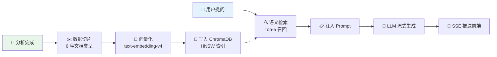
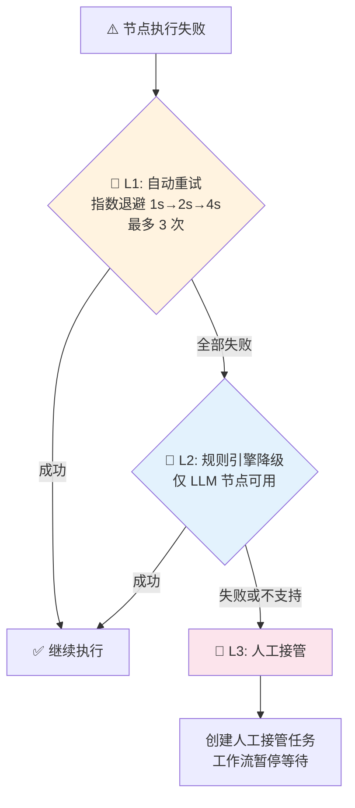
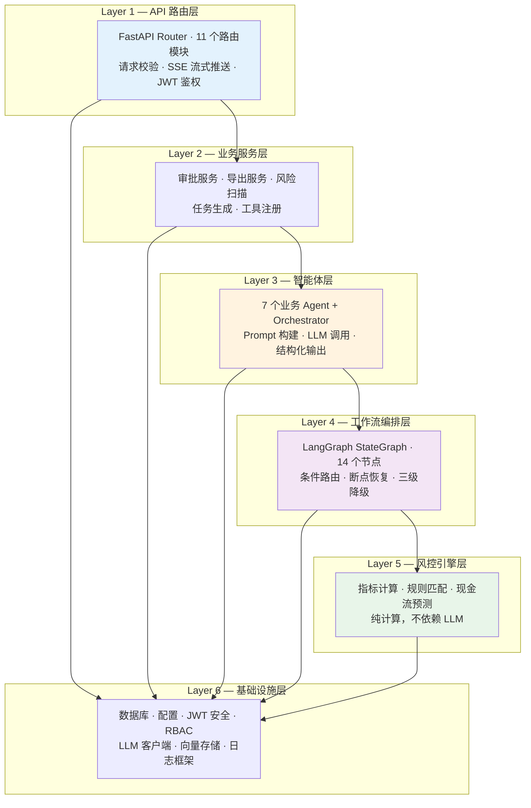

# 商家经营保障 Agent —— 7 个 AI Agent 协作的智能风控分析系统

> **一句话定位：7 个 AI Agent 组成专家团队，从风险识别到处置落地，全链路自动化。**

---

你是否遇到过这样的场景：商家退货率突然飙升、现金流断裂风险逼近、疑似欺诈行为需要紧急判断——传统的人工排查耗时数小时，还可能遗漏关键信号？

**商家经营保障 Agent** 用一条全自动的 AI 分析流水线解决这个问题。从案件分诊到根因分析，从证据收集到处置建议，再到合规校验和审批执行——7 个专业 Agent 各司其职，像一支训练有素的风控专家团队，在几分钟内完成过去需要数小时的分析工作。

更重要的是，这不是一个"Demo 级别"的 AI 实验品。它已经从 V1 迭代到 V5，拥有三级降级容灾、完整的审批闭环、RBAC 权限体系（5 种角色 × 18 种权限）、LLM-as-Judge 评测中心、Prompt 灰度分流——这是一套**可直接投入生产的 AI 原生系统**。

---

## 🧠 核心亮点一：7 Agent 协作流水线

系统的核心是 7 个专业 Agent + 1 个 Orchestrator 编排器。每个 Agent 独立负责一个分析环节，通过 [LangGraph](https://github.com/langchain-ai/langgraph)（一个有状态的多 Agent 工作流引擎）编排为完整的分析流水线。

### Agent 角色一览

| Agent | 角色 | 职责 | 是否依赖 LLM |
|-------|------|------|:-----------:|
| 🏥 **Triage Agent** | 案件分诊师 | 判断案件类型（现金缺口/疑似欺诈/融资/理赔）和优先级 | ✅ |
| 🔍 **Evidence Agent** | 证据调查员 | 从订单、退货、物流、结算等多数据源提取证据链 | ❌ |
| 📊 **Analysis Agent** | 根因分析师 | 多维度根因分析，输出结构化风险评估 | ✅ |
| 💡 **Recommend Agent** | 处置建议官 | 生成融资/理赔/人工复核等具体处置方案 | ✅ |
| 🛡️ **Compliance Agent** | 合规审查员 | 校验建议的合规性：禁止性结论检查、强制人工复核规则 | ❌ |
| 📝 **Summary Agent** | 报告撰写员 | 生成人类可读的案件处理摘要 | ✅ |
| ⚡ **Execution Agent** | 执行落地官 | 将审批通过的建议转化为融资申请/理赔/复核任务 | ❌ |

### 协作流程

```mermaid
graph LR
    A["🏥 分诊<br/>Triage"] --> B["📊 计算指标<br/>Metrics"]
    B --> C["💰 现金流预测<br/>Forecast"]
    C --> D["🔍 收集证据<br/>Evidence"]
    D --> E["🧠 根因分析<br/>Analysis"]
    E --> F["💡 生成建议<br/>Recommend"]
    F --> G["🛡️ 合规校验<br/>Compliance"]
    G --> H["📝 生成报告<br/>Summary"]
    H --> I["✅ 创建审批<br/>Approval"]
    I --> J["⏸ 等待审批"]
    J --> K["⚡ 执行落地<br/>Execution"]

    style A fill:#e3f2fd
    style E fill:#fff3e0
    style G fill:#fce4ec
    style K fill:#e8f5e9
```



**LangGraph 编排引擎**的独特优势：

- **有状态编排**：`GraphState` 在 14 个节点间传递，每个 Agent 的输出自动成为下游 Agent 的输入上下文
- **条件路由**：分诊结果决定后续处理路径，合规校验结果决定是否放行或阻断
- **断点恢复**：工作流在等待审批时自动暂停，审批通过后从断点恢复执行
- **累积式上下文**：`analysis_context` 机制让每个 Agent 的洞察像接力赛一样传递给后续 Agent（单条上限 200 字符，总上下文上限 1500 字符，超限 FIFO 淘汰）

---

## 💬 核心亮点二：RAG 语义对话

传统风控系统的分析报告是"静态"的——生成之后你只能看，无法追问。

本系统在每次分析完成后，自动将案件数据切片并向量化存入 ChromaDB（一个轻量级嵌入式向量数据库）。之后你可以像跟一个"分析师助理"对话一样，用自然语言追问：

> *"为什么退货率突然飙升？"*
> *"这个融资建议的依据是什么？"*
> *"这家商家的现金流能撑多久？"*

系统会通过语义检索（HNSW 余弦相似度），从案件知识库中精准召回最相关的分析片段，注入到 LLM 对话上下文中，给出**有据可查**的回答，并通过 SSE（Server-Sent Events）实时流式推送到前端。

### 工作原理



**6 种文档切片类型**：案件摘要、根因分析（每条独立成片）、动作建议（每条独立成片）、现金流预测、证据项（每条独立成片）、商家信息。每个案件典型切片数 10~20 片，按语义单元切片而非固定长度，保证召回的是完整上下文。

**嵌入模型**：阿里云通义 `text-embedding-v4`（1024 维），与分析使用的通义千问 LLM 同属一套模型家族，语义空间对齐度高。

**对比传统方式**：

| 维度 | 传统报告模式 | RAG 对话模式 |
|------|-------------|-------------|
| 信息获取 | 通读整份报告，自己找答案 | 直接提问，精准回答 |
| 追问深度 | 不支持，需要重新分析 | 随时追问，上下文连续 |
| 交互体验 | 单向输出 | 双向对话 |
| 信息密度 | 全量展示，信噪比低 | 按需召回，精准推送 |

---

## 🛡️ 核心亮点三：三级降级容灾

很多 AI 系统在 Demo 阶段看起来很美好，但到了生产环境，一旦 LLM 服务抖动、超时或不可用，整个系统就瘫痪了。

本系统从设计之初就把**"AI 挂了怎么办"**作为核心命题，实现了三级降级容灾机制：



| 级别 | 策略 | 说明 | 适用范围 |
|------|------|------|----------|
| **L1 自动重试** | 指数退避（1s → 2s → 4s） | 应对临时网络抖动和 API 限流 | 所有 14 个工作流节点 |
| **L2 规则引擎降级** | LLM 挂了，用预置规则兜底 | 风控引擎的规则评估 + 建议生成不依赖 LLM | 诊断节点、建议节点 |
| **L3 人工接管** | 创建工单，工作流暂停等人处理 | 最终兜底，确保不丢失任何案件 | 所有节点 |

**Structured Output 也有降级**：调用 LLM 的结构化输出（`beta.parse()`）如果失败，自动降级到 JSON 模式（`response_format=json_object`），再通过 Pydantic 校验，确保 Agent 始终能输出结构化数据。

**RAG 对话也有降级**：ChromaDB 不可用 → 降级到 ChromaDB 默认嵌入模型 → 再降级到直接把分析结果全量注入 Prompt。对话功能在任何异常下都可用。

这意味着：**即使 LLM 完全不可用，系统仍然能通过规则引擎完成基本的风险评估和处置建议。**

---

## 🏗️ 技术架构全景

系统采用六层分层架构，严格遵循**上层只调用下层、禁止跨层或反向调用**的约束：



---

## 🔧 技术栈

| 类别 | 技术 | 用途 |
|------|------|------|
| **Web 框架** | FastAPI | 异步 Web 框架，内置 OpenAPI 文档，原生 SSE 支持 |
| **工作流引擎** | LangGraph | 有状态的多 Agent 编排，支持条件路由和断点恢复 |
| **大语言模型** | 通义千问（qwen-plus） | 分诊、诊断、建议、总结等 4 个 LLM Agent 的推理引擎 |
| **嵌入模型** | text-embedding-v4 | RAG 语义检索的向量化模型（1024 维） |
| **向量数据库** | ChromaDB | 案件知识库，HNSW 索引，余弦相似度检索 |
| **关系数据库** | MySQL 8.0 | 27 张表，覆盖案件、商家、任务、审批、评测等业务数据 |
| **数据校验** | Pydantic v2 | 全链路类型安全：请求校验、Agent I/O Schema、配置加载 |
| **认证鉴权** | JWT + RBAC | 双令牌机制（Access + Refresh），5 角色 × 18 权限矩阵 |
| **日志框架** | Loguru | 双 Sink（控制台 + 文件），按总大小轮转清理 |
| **容器化** | Docker Compose | 一键部署：MySQL + Backend + Frontend + Nginx + Loki + Grafana |

---

## 🎯 适用场景

### 📦 电商风控分析

退货率异常、结算延迟、现金流断裂——这些是电商平台每天都在面对的商家风险场景。本系统开箱即用，7 个 Agent 覆盖从风险识别到处置执行的完整链路。

### 🏦 金融风险评估

融资资格判断、欺诈检测、理赔审核——系统的规则引擎 + LLM 分析双轨制，在保证效率的同时确保合规性。合规 Agent 的禁止性结论检查和强制人工复核机制，特别适合金融场景的强合规要求。

### 🤖 多 Agent 系统学习参考

如果你正在学习或构建多 Agent 系统，这个项目是一个绝佳的实战参考：
- **完整的 LangGraph 工作流**：14 个节点、3 个条件路由、断点恢复
- **Agent 数据契约**：Pydantic Schema 约束所有 Agent 的输入输出
- **三级降级策略**：从自动重试到规则兜底再到人工接管的完整容灾设计
- **RAG 对话**：从切片索引到语义检索到 Prompt 注入的端到端实现
- **生产级工程化**：审批闭环、RBAC 权限、Prompt 灰度、评测中心

### 🧪 AI 工程化实践

已经用 LLM 做了 PoC，但不知道怎么把它变成生产级系统？这个项目展示了从"能用"到"可靠"的完整路径：
- **Prompt 灰度分流**：新版 Prompt 可以先给 10% 流量试水，验证通过再全量上线
- **LLM-as-Judge 评测中心**：用 LLM 当裁判，自动评估分析质量（综合评分、幻觉检测、证据覆盖率）
- **完整审批闭环**：AI 的建议不会直接执行，必须经过对应角色的审批后才能落地

---

## 🚀 快速体验

### 环境要求

- Docker & Docker Compose
- 通义千问 API Key（[获取地址](https://dashscope.console.aliyun.com/)）

### 一键启动

```bash
# 1. 克隆仓库
git clone <repo-url> && cd m-agents

# 2. 配置环境变量
cp .env.example .env
# 编辑 .env，填入你的 OPENAI_API_KEY（通义千问 DashScope Key）

# 3. 一键启动所有服务
docker compose up -d

# 4. 访问系统
# 前端界面：http://localhost
# API 文档：http://localhost/api/docs
# Grafana 监控：http://localhost:3100
```

启动后，系统会自动初始化数据库、创建默认管理员账户。打开浏览器，你就可以创建一个风险案件，点击"开始分析"，然后通过 SSE 实时流式输出观看 7 个 Agent 依次工作的全过程。

---

## 📊 数字一览

| 指标 | 数值 |
|------|------|
| AI Agent 数量 | 7 个业务 Agent + 1 个编排器 |
| 工作流节点 | 14 个（含 3 个条件路由） |
| 数据库表 | 27 张 |
| API 端点 | 11 个路由模块 |
| RBAC 权限 | 5 种角色 × 18 种权限 |
| RAG 文档类型 | 6 种切片类型 |
| 降级层级 | 3 级（自动重试 → 规则兜底 → 人工接管） |
| 架构层数 | 6 层分层架构 |

---

> **版本基线**：V5 | **技术栈**：FastAPI + LangGraph + 通义千问 + ChromaDB + MySQL + Docker
>
> 这不是另一个 AI Demo，这是一套可以直接跑在生产环境里的多 Agent 风控分析系统。
